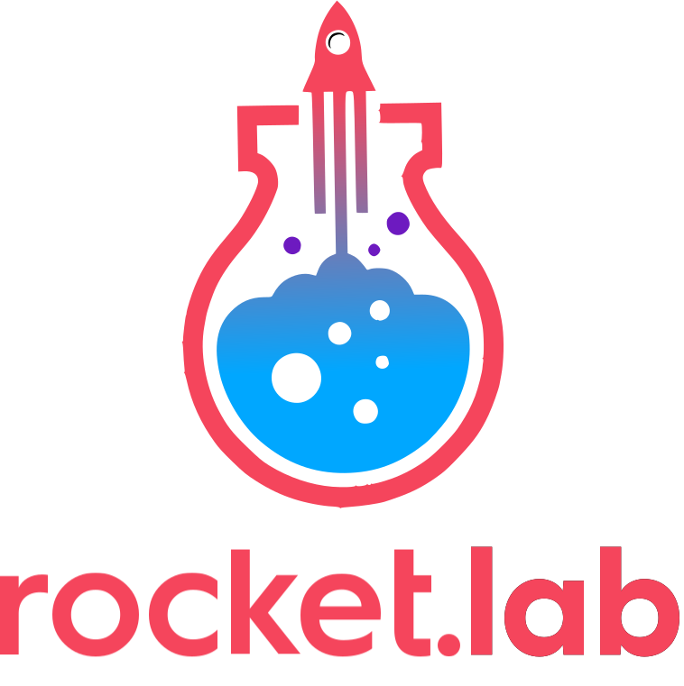

# Welcome to rocket.lab

## What is rocket.lab
rocket.lab is a webcast series initiated by rocket.chat
## Youtube channel
you can watch rocket.lab at our [youtube channel](https://www.youtube.com/c/RocketChatApp)
## Contributing
We love to see contributions, there is several ways you can help:
### suggesting topics
As easy as creating a new issue with tag #topic these can be upvoted with comments
### become a guest
If you have a cool integration or topic create an issue and tag it with #guest we try to make two episodes per month.
### community edition
If you've created a lab video or tutorial please create an issue with #ce so we can refer your video, this tag is also for finding friends to create your own rocket.lab episode.